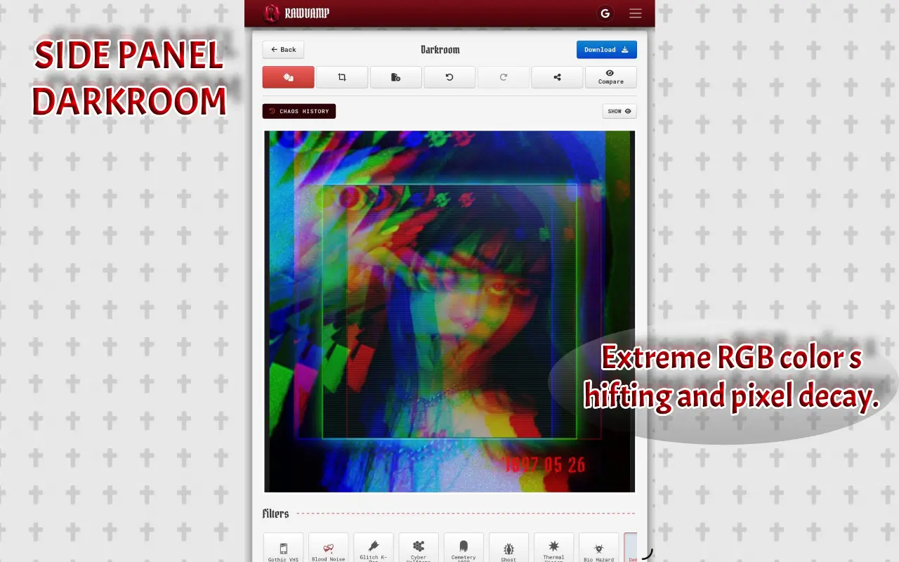
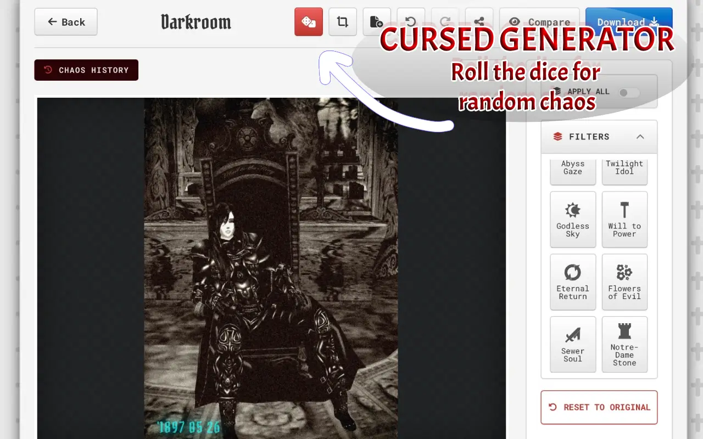
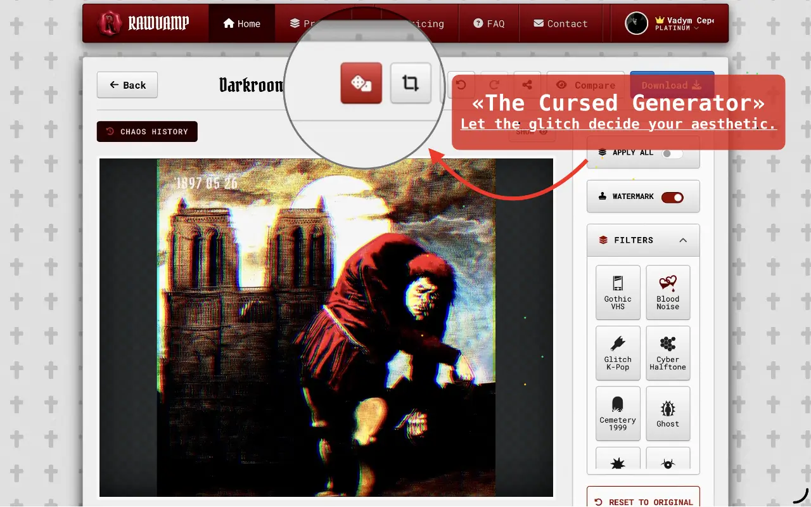
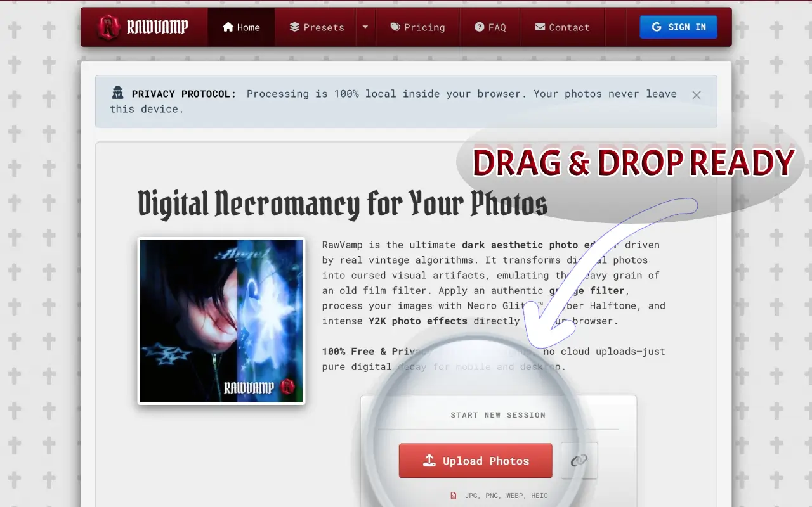
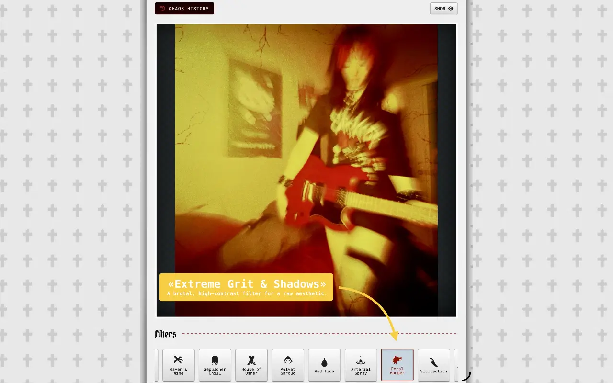
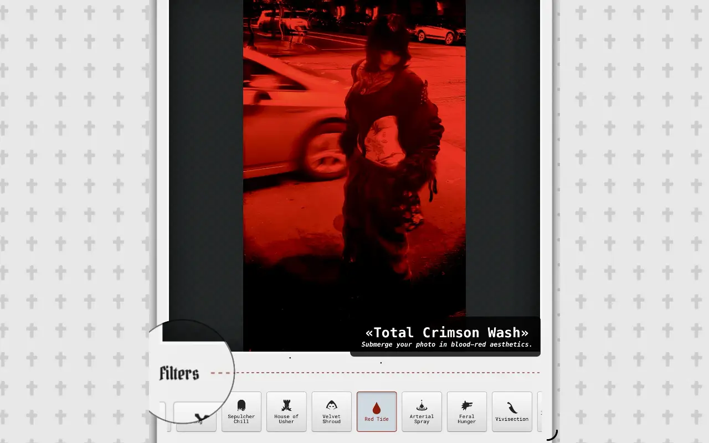
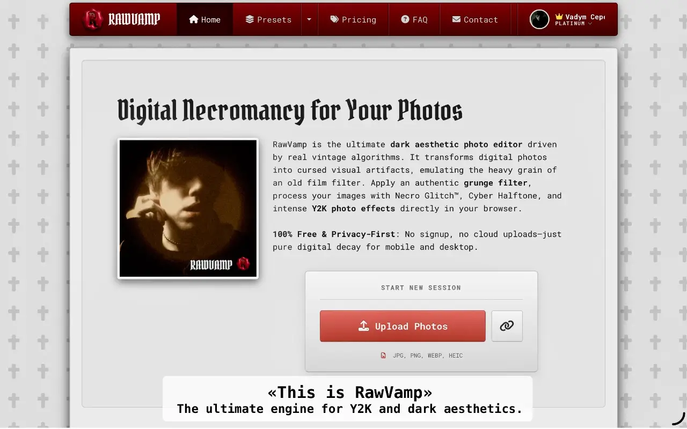
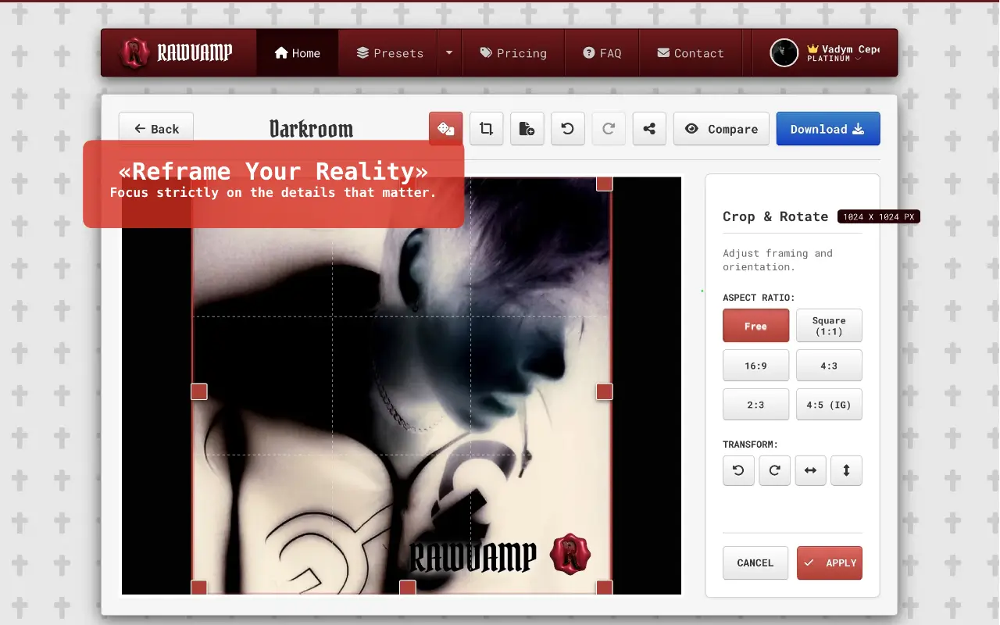
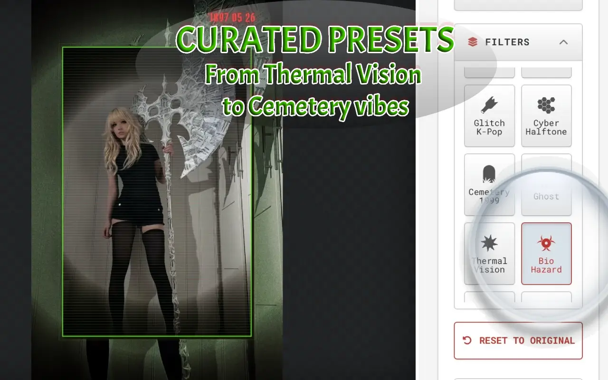
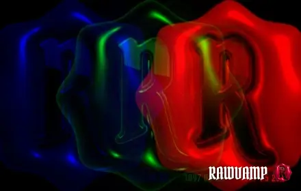

  
  
    
  
  <h1>RawVamp: The Ultimate Dark Aesthetic Photo Editor</h1>
  
<b>Browser-based photo editor focused on dark aesthetic image processing, glitch art, and complete local privacy.</b>

  
   

  &nbsp;&nbsp;
  &nbsp;&nbsp;
  

 

## 🦇 Professional Digital Decay

[RawVamp](https://rawvamp.com) is a next-gen, browser-based photo editing application designed for content creators, photographers, social media managers, graphic designers, and photography professionals working with gothic, grunge, emo, Y2K, and alternative visual styles. Our application applies sophisticated dark aesthetic filters, vintage-style visual effects, and digital decay to your images without the need for heavy desktop software.

All image processing is executed **100% locally within your web browser** via a custom WebGL engine. Your visual data never leaves your device, ensuring absolute zero-upload privacy and zero cloud uploads.

---

## ⚙️ Core Processing Engines

### 1. 🩸 Necro Glitch, The CURSED Generator & Glitch Art Maker
A dedicated glitch engine that procedurally tears apart RGB color channels.
* **Dreamcore PFP Maker:** Generate an eerie weirdcore aesthetic avatar with unpredictable color displacement and pixel decay.
* **Analog Artifacts:** Add an authentic **vhs error effect**, static noise, and scan lines texture to any image.
* **Procedural Chaos & Randomized Output:** Roll the dice to spawn completely unique, cursed photos and diabolical images.

  <table width="100%" border="0" cellspacing="0" cellpadding="0">
    <tr>
      <td width="33%"></td>
      <td width="33%"></td>
      <td width="33%"></td>
    </tr>
    <tr>
      <td width="33%"></td>
      <td width="33%"></td>
      <td width="33%"></td>
    </tr>
  </table>

 

### 2. 🌑 Smart Image Darkener & Tone Protocol
Standard applications ruin your images by simply dropping the brightness. Our engine acts as a professional **color darkener**, selectively lowering exposure while protecting midtone saturation.
* **Cinematic Shadow Overlay:** Dim photos and naturally darken background of photo elements without relying on fake PNGs.
* **Absolute Blackout:** Crush the contrast to make an image black, create a high-resolution pitch black photo, or turn photos black and white seamlessly.
* **Negative Inversion:** Toggle the **negative photo filter** to solarize tints and create a high-contrast evil photo.

  <table width="100%" border="0" cellspacing="0" cellpadding="0">
    <tr>
      <td width="33%"></td>
      <td width="33%"></td>
      <td width="33%"></td>
    </tr>
    <tr>
      <td width="33%"></td>
      <td width="33%"></td>
      <td width="33%"></td>
    </tr>
  </table>

---

## 🖥️ Browser Extension: The Native Darkroom

Integrate digital decay directly into your workflow. The RawVamp browser extension for Chrome, Edge, Opera, and Brave allows you to **edit photo in browser** instantly. Right-click web images or use the Glitch Tab feature to capture your screen, bringing the full engine into your active web environment.

  
   
  
    
  <table width="100%" border="0" cellspacing="0" cellpadding="0">
    <tr>
      <td width="50%"></td>
      <td width="50%"></td>
    </tr>
    <tr>
      <td width="50%"></td>
      <td width="50%"></td>
    </tr>
  </table>

---

## 🛠️ Technical Architecture & Features

The RawVamp software architecture is engineered for performance, quality retention, and professional utility. It prioritizes local computation, speed, and privacy. The core editing functionality operates independently and does not require external APIs.

* **Client-Side WebGL:** Processes heavy 90s grunge texture, VHS distortion, and Cyber Halftone dithering entirely on your local GPU.
* **Broad Format Support:** Natively supports JPG, PNG, WEBP, and HEIC file formats.
* **Smart Session Recovery:** The application automatically caches your editing progress locally, restoring unsaved edits if your browser closes unexpectedly.
* **High-Resolution Export:** Export options range from standard definition up to 4K / Original resolution, maintaining image quality via lossless PNG compression.
* **Batch Processing:** Premium tiers support synchronizing your aesthetic edits across up to 10 photos simultaneously, with ZIP archive download capabilities for professional workflows.

 

  
    
  <i>"Enable creation of vintage goth and dark aesthetic visuals with authentic grunge, Y2K, webcore, and glitch effects."</i>  
  <b>[RESURRECT YOUR IMAGES @ RAWVAMP.COM](https://rawvamp.com)</b>

