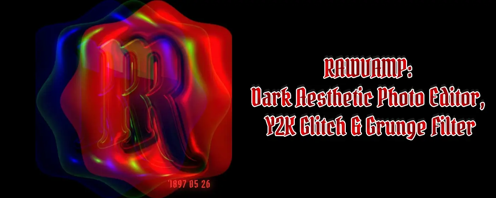

  
  
    
  
  <h1>RawVamp: The Ultimate Dark Aesthetic Photo Editor</h1>
  
<b>Browser-based photo editor focused on dark aesthetic image processing, glitch art, and complete local privacy.</b>

  
   

  
  
  

 

## 🦇 Professional Digital Decay

[RawVamp](https://rawvamp.com) is designed for content creators, photographers, and graphic designers working with gothic, grunge, emo, Y2K, and alternative visual styles. Our application applies sophisticated dark aesthetic filters and vintage effects to digital images without the need for heavy desktop software.

All image processing is executed **100% locally within your web browser** via a custom WebGL engine. Your visual data never leaves your device, ensuring absolute privacy and zero cloud uploads.

---

## ⚙️ Core Processing Engines

### 1. 🩸 Necro Glitch & The CURSED Generator
A dedicated glitch art maker that procedurally tears apart RGB color channels to create a genuine **glitch photo effect** instantly.
* **Dreamcore PFP Maker:** Generate an eerie weirdcore aesthetic avatar with unpredictable color displacement.
* **Analog Artifacts:** Add an authentic **vhs error effect**, static noise, and scan lines texture to any image.
* **Procedural Chaos:** Roll the dice to spawn completely unique, cursed photos and diabolical images.

  <table width="100%" border="0" cellspacing="0" cellpadding="0">
    <tr>
      <td width="33%"></td>
      <td width="33%"></td>
      <td width="33%"></td>
    </tr>
  </table>

 

### 2. 🌑 Tone Protocol & Smart Image Darkener
Standard applications ruin your images by simply dropping the brightness. Our engine acts as a professional **color darkener**, selectively lowering exposure while protecting midtone saturation.
* **Cinematic Shadow Overlay:** Dim photos and naturally darken background of photo elements without fake PNGs.
* **Absolute Blackout:** Crush the contrast to make an image black or create a high-resolution pitch black photo.
* **Negative Inversion:** Toggle the **negative photo filter** to solarize tints and create a high-contrast evil photo.

  <table width="100%" border="0" cellspacing="0" cellpadding="0">
    <tr>
      <td width="33%"></td>
      <td width="33%"></td>
      <td width="33%"></td>
    </tr>
  </table>

---

## 🖥️ Browser Extension: The Native Darkroom

Integrate digital decay directly into your workflow. The RawVamp browser extension for Chrome, Edge, Opera, and Brave allows you to **edit photo in browser** instantly. Right-click web images or use the Glitch Tab feature to capture your screen, bringing the full engine into your active web environment.

  
    
  <table width="100%" border="0" cellspacing="0" cellpadding="0">
    <tr>
      <td width="50%"></td>
      <td width="50%"></td>
    </tr>
    <tr>
      <td></td>
      <td></td>
    </tr>
  </table>

---

## 🛠️ Technical Architecture & Features

The RawVamp application is engineered for performance, quality retention, and professional utility.

* **Client-Side WebGL Processing:** Processes heavy 90s grunge texture, VHS distortion, and Cyber Halftone dithering entirely on your local GPU. Eliminates dependence on server-side rendering.
* **Broad Format Support:** Natively supports JPG, PNG, WEBP, and HEIC file formats.
* **Smart Session Recovery:** The application automatically caches your editing progress locally, restoring unsaved edits if your browser closes unexpectedly.
* **High-Resolution Export:** Export options range from standard definition up to 4K / Original resolution, maintaining image quality via lossless PNG compression.
* **Batch Processing:** Premium tiers support synchronizing aesthetic edits across up to 10 photos simultaneously, with ZIP archive download capabilities.

 

  <i>"Enable creation of vintage goth and dark aesthetic visuals with authentic grunge, Y2K, webcore, and glitch effects."</i>  
  <b>[RESURRECT YOUR IMAGES @ RAWVAMP.COM](https://rawvamp.com)</b>

